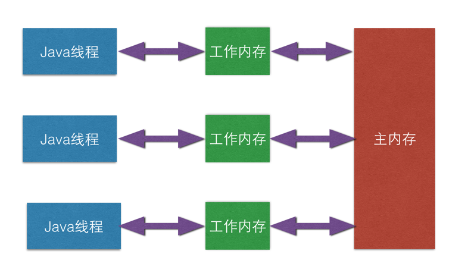

一.从可见性说起

单个CPU的运算速度的提升已经变得越来越困难，而且代价高昂，所以人们采用了另一种思路–使用多个CPU。多处理器架构虽然能够方便的提升计算机的运算能力，但是其实它也引入了其它的一些复杂性。我们知道，CPU的速度要远快于内存，所以为了提升效率，计算机系统中往往会在CPU和内存之间加入高速缓存。虽然多个CPU之间是共享同一个内存设备的，但是每个CPU都有自己单独的高速缓存。当多个处理器的运算任务都涉及到同一块内存区域时，将可能出现各CPU的缓存数据不一致的情况。

Java虚拟机规范中试图定义一种Java内存模型（Java Memory Model，JMM）来屏蔽掉各种硬件和操作系统的内存访问差异，以实现让Java程序在各种平台下都能达到一致的内存访问效果。Java内存模型规定了所有的变量都存储在主内存。每个线程还有自己的工作内存（可以与CPU的高速缓存类比），线程的工作内存中保存了被线程使用到的变量的主内存副本拷贝，线程对变量的所有操作都必须在工作内存中进行，而不能直接读写主内存中的变量。不同的线程之间也无法直接访问对方工作内存中的变量，线程间变量值的传递需要通过主内存来完成。线程，工作内存，主内存的关系如下图：



对于普通的变量而言，在被多个线程共享时，无法保证某个线程对共享变量的修改会立即对其它线程可见，因为这取决于工作内存中的变量副本何时同步到主内存当中。

二.volatile语义

1.确保可见性

volatile的第一个语义保证共享变量在多线程间的可见性。对于volatile变量而言，如果某个线程对volatile变量做出了修改，那么这个修改对于其他线程是立即可见的。之所以能保证这一点，是因为对工作内存的修改操作会立即回写到主内存当中。而且如果是写操作，它会导致其他CPU的对应的缓存行失效，其它线程在使用该volatile变量时，会重新从主内存中读取变量的值并放入工作内存中。

大家都知道对象锁能够保证线程间互斥，但是却容易忽略一点，就是对象锁也可以保证可见性，因为线程在进入临界区之前，会从主存中读取变量的最新值。同时，线程在释放锁之前，必须先把它对共享数据做出的修改同步到内存中。相比于对象锁，volatile对可见性的保证更加轻量级。

2.防止重排序

volatile的第二个语义是禁止指令重排序优化。对于普通的变量，仅仅能保证在执行过程中所有依赖赋值结果的地方都能获取到正确的结果，而不能保证变量赋值操作的顺序与程序代码中的执行顺序一致（JVM和操作系统都可能会对指令进行重排序优化）。而在同一个线程内，是无法感知到只一点的，这就是Java内存模型中描述的线程内表现为串行的语义（Within-Thread As-If-Serial Semantic）。

观察加入volatile关键字和没有加入volatile关键字时所生成的汇编代码发现，加入volatile关键字时，会多出一个lock前缀指令。lock前缀指令实际上相当于一个内存屏障（也成内存栅栏），它能确保指令重排序时不会把其后面的指令排到内存屏障之前的位置，也不会把前面的指令排到内存屏障的后面。也就是说，在执行到内存屏障这句指令时，在它前面的操作已经全部完成，而在它后面的操作还未开始。

三.volatile不能保证原子性


```
public class VolatileTest {
    public static volatile int race = 0;   
    public static void increase() {
        race++;
    }
    public static void main(String[] args) {
        for(int i=0; i<20; i++) {
            new Thread(){
                public void run() {
                    for(int j=0; j<10000; j++) {
                        increase();
          }
                };
            }.start();
        }    
        while(Thread.activeCount()>1) {
            Thread.yield();
    }
        System.out.println(race);
    }
}
```


这段代码启动了20个线程，每个线程对race变量自增10000次，如果这段代码能够正确的并发执行的话，那么最终输出的结果应该是200000。但是运行程序时会发现，每次输出的结果都不相同，而且都小于200000。

问题的原因在于race++。因为自增操作并不是原子的，它包括“读取”，“增加”，“写入”等操作，虽然volatile能保证每次读取的值都是最新的，但是如果线程a在执行增加操作时，线程b已经对race的值做了修改，那么线程a的操作的数据就变成了过期的数据。

所以，volatile不能保证原子性。如果要实现原子的修改，可以使用锁，或者使用java.util.concurrent.atomic包中提供的原子类。

四.volatile的适用场景

volatile虽然方便，但却不容易被正确使用。只有满足了以下所有的标准后，才能使用volatile变量：

1.写入变量时不依赖变量的当前值，或者能够确保只有单一的线程修改变量的值。

2.变量不需要与其他状态变量共同参与不变约束（不变约束可以理解为限制一个类的正确状态的规则）

3.访问变量时，没有其他原因需要加锁

volatile的一个典型应用场景就是作为标识量：


```
volatile boolean shutdown;
public void shutdown() {
  shutdown = true;
}
public void doWork() {
  while (!shutdown) {
    // doSomething
  }
}
```


 

https://km.sankuai.com/page/40969299 