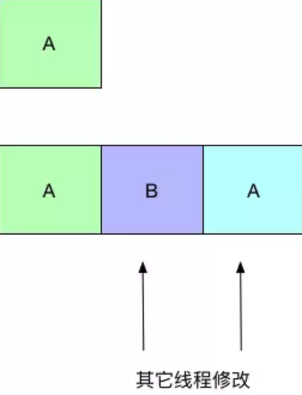
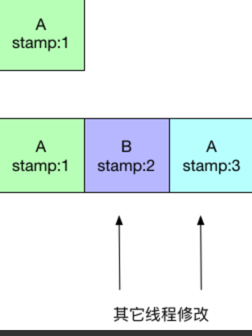

## 了解CAS（Compare-And-Swap）

CAS即对比交换，它在保证数据原子性的前提下尽可能的减少了锁的使用，很多编程语言或者系统实现上都大量的使用了CAS。

### JAVA中CAS的实现

JAVA中的cas主要使用的是Unsafe方法，Unsafe的CAS操作主要是基于硬件平台的汇编指令，目前的处理器基本都支持CAS，只不过不同的厂家的实现不一样罢了。

Unsafe提供了三个方法用于CAS操作，分别是

```
public final native boolean compareAndSwapObject(Object value, long valueOffset, Object expect, Object update);

public final native boolean compareAndSwapInt(Object value, long valueOffset, int expect, int update);

public final native boolean compareAndSwapLong(Object value, long valueOffset, long expect, long update);
```

- value 表示 需要操作的对象
- valueOffset 表示 对象(value)的地址的偏移量（通过`Unsafe.objectFieldOffset(Field valueField)`获取）
- expect 表示更新时value的期待值
- update 表示将要更新的值

具体过程为每次在执行CAS操作时，线程会根据valueOffset去内存中获取当前值去跟expect的值做对比如果一致则修改并返回true，如果不一致说明有别的线程也在修改此对象的值，则返回false

Unsafe类中compareAndSwapInt的具体实现：

```
UNSAFE_ENTRY(jboolean, Unsafe_CompareAndSwapInt(JNIEnv *env, jobject unsafe, jobject obj, jlong offset, jint e, jint x))
  UnsafeWrapper("Unsafe_CompareAndSwapInt");
  oop p = JNIHandles::resolve(obj);
  jint* addr = (jint *) index_oop_from_field_offset_long(p, offset);
  return (jint)(Atomic::cmpxchg(x, addr, e)) == e;
UNSAFE_END
```

## ABA问题

线程1准备用CAS修改变量值A，在此之前，其它线程将变量的值由A替换为B，又由B替换为A，然后线程1执行CAS时发现变量的值仍然为A，所以CAS成功。但实际上这时的现场已经和最初不同了。




### 例子

```
public static AtomicInteger a = new AtomicInteger(1);
public static void main(String[] args){
    Thread main = new Thread(() -> {
        System.out.println("操作线程" + Thread.currentThread() +",初始值 = " + a);  //定义变量 a = 1
        try {
            Thread.sleep(1000);  //等待1秒 ，以便让干扰线程执行
        } catch (InterruptedException e) {
            e.printStackTrace();
        }
        boolean isCASSuccess = a.compareAndSet(1,2); // CAS操作
        System.out.println("操作线程" + Thread.currentThread() +",CAS操作结果: " + isCASSuccess);
    },"主操作线程");

    Thread other = new Thread(() -> {
        a.incrementAndGet(); // a 加 1, a + 1 = 1 + 1 = 2
        System.out.println("操作线程" + Thread.currentThread() +",【increment】 ,值 = "+ a);
        a.decrementAndGet(); // a 减 1, a - 1 = 2 - 1 = 1
        System.out.println("操作线程" + Thread.currentThread() +",【decrement】 ,值 = "+ a);
    },"干扰线程");

    main.start();
    other.start();
}
// 输出
> 操作线程Thread[主操作线程,5,main],初始值 = 1
> 操作线程Thread[干扰线程,5,main],【increment】 ,值 = 2
> 操作线程Thread[干扰线程,5,main],【decrement】 ,值 = 1
> 操作线程Thread[主操作线程,5,main],CAS操作结果: true
```

## 解决ABA方案

### 思路

解决ABA最简单的方案就是给值加一个修改版本号，每次值变化，都会修改它版本号，CAS操作时都对比此版本号。




### JAVA中ABA中解决方案(AtomicStampedReference)

AtomicStampedReference主要维护包含一个对象引用以及一个可以自动更新的整数"stamp"的pair对象来解决ABA问题。

```
//关键代码
public class AtomicStampedReference<V> {
    private static class Pair<T> {
        final T reference;  //维护对象引用
        final int stamp;  //用于标志版本
        private Pair(T reference, int stamp) {
            this.reference = reference;
            this.stamp = stamp;
        }
        static <T> Pair<T> of(T reference, int stamp) {
            return new Pair<T>(reference, stamp);
        }
    }
    private volatile Pair<V> pair;
    ....
    /**
      * expectedReference ：更新之前的原始值
      * newReference : 将要更新的新值
      * expectedStamp : 期待更新的标志版本
      * newStamp : 将要更新的标志版本
      */
    public boolean compareAndSet(V   expectedReference,
                                 V   newReference,
                                 int expectedStamp,
                                 int newStamp) {
        Pair<V> current = pair; //获取当前pair
        return
            expectedReference == current.reference && //原始值等于当前pair的值引用，说明值未变化
            expectedStamp == current.stamp && // 原始标记版本等于当前pair的标记版本，说明标记未变化
            ((newReference == current.reference &&
              newStamp == current.stamp) || // 将要更新的值和标记都没有变化
             casPair(current, Pair.of(newReference, newStamp))); // cas 更新pair
    }
}    
```

### 例子

```
private static AtomicStampedReference<Integer> atomicStampedRef =
        new AtomicStampedReference<>(1, 0);
public static void main(String[] args){
    Thread main = new Thread(() -> {
        System.out.println("操作线程" + Thread.currentThread() +",初始值 a = " + atomicStampedRef.getReference());
        int stamp = atomicStampedRef.getStamp(); //获取当前标识别
        try {
            Thread.sleep(5000); //等待2秒 ，以便让干扰线程执行
        } catch (InterruptedException e) {
            e.printStackTrace();
        }
        boolean isCASSuccess = atomicStampedRef.compareAndSet(1,2,stamp,stamp +1);  //此时expectedReference未发生改变，但是stamp已经被修改了,所以CAS失败
        System.out.println("操作线程" + Thread.currentThread() +",CAS操作结果: " + isCASSuccess);
    },"主操作线程");

    Thread other = new Thread(() -> {
        atomicStampedRef.compareAndSet(1,2,atomicStampedRef.getStamp(),atomicStampedRef.getStamp() +1);
        System.out.println("操作线程" + Thread.currentThread() +",【increment】 ,值 = "+ atomicStampedRef.getReference());
        atomicStampedRef.compareAndSet(2,1,atomicStampedRef.getStamp(),atomicStampedRef.getStamp() +1);
        System.out.println("操作线程" + Thread.currentThread() +",【decrement】 ,值 = "+ atomicStampedRef.getReference());
    },"干扰线程");

    main.start();
    other.start();
}
// 输出
> 操作线程Thread[干扰线程,5,main],【increment】 ,值 = 2
> 操作线程Thread[干扰线程,5,main],【decrement】 ,值 = 1
> 操作线程Thread[主操作线程,5,main],初始值 a = 1
> 操作线程Thread[主操作线程,5,main],CAS操作结果: false
```