# **简介**

java集合中最顶层的接口为Connection接口，其中有两个接口实现了Connection接口，分别为Set接口和List接口。Set接口表现为无序，不能重复；List接口表现为有序，可重复。其中ArrayList和LinkedList是List接口的实现类中最常用的两个。下面针对ArrayList和LinkedList这两个实现类做一些说明：

​     

（1）ArrayList：ArrayList是一个泛型类，底层采用数组结构保存对象。数组结构的优点是便于对集合进行快速的随机访问，即如果需要经常根据索引位置访问集合中的对象，使用由ArrayList类实现的List集合的效率较好。数组结构的缺点是向指定索引位置插入对象和删除指定索引位置对象的速度较慢，并且插入或删除对象的索引位置越小效率越低，原因是当向指定的索引位置插入对象时，会同时将指定索引位置及之后的所有对象相应的向后移动一位。

（2）LinkedList：LinkedList是一个泛型类，底层是一个双向链表，所以它在执行插入和删除操作时比ArrayList更加的高效，但也因为链表的数据结构，所以在随机访问方面要比ArrayList差。另外，LinkedList还提供了一些可以使其作为栈、队列、双端队列的方法。

# **内部实现**

## **ArrayList内部实现**：

   

将从两方面来剖析ArrayList，即存储结构-字段和功能实现-方法。

## **存储结构-字段**

从结构实现来讲，ArrayList是数组实现的。首先从源码中看出

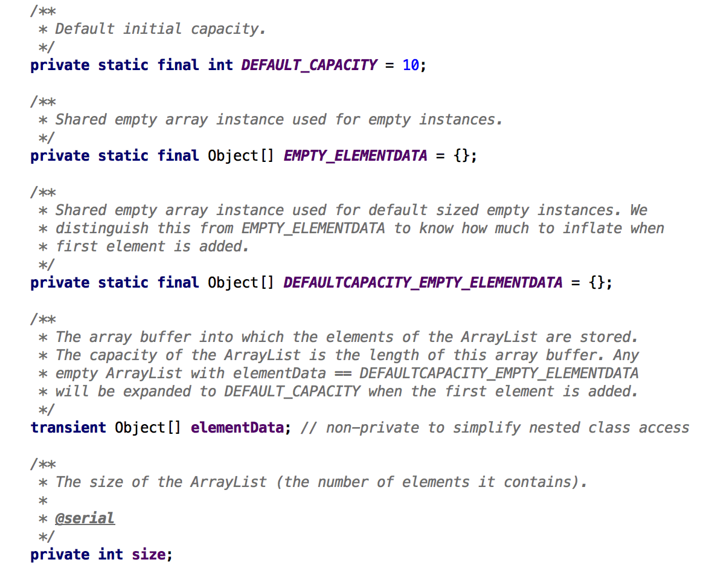

ArrayList中维护了一个Object类型的数组elementData，即用来存放数据。注意的是这个数组是**transient**类型，这个留到下面再说。其次ArrayList默认大小为10。其中size为当前数组中元素的个数。其余的两个参数都用做初始化elementData数组。

## **功能实现-方法**

   ArrayList中功能主要包括增删改查，还有扩容操作。这里主要对扩容操作，add方法进行展开分析。

## **1.扩容操作**

扩容就是重新计算容量，想ArrayList对象不停的添加元素，而ArrayList对象内部的数组无法装载更多的元素时，对象就需要扩大数组的长度，以便能装入更多的元素。java中的数组无法自动扩容，方法便是用一个新的数组代替已有的容量小的数组。ArrayList的扩容入口函数为ensureCapacity和ensureCapacityInternal，java8源码如下：

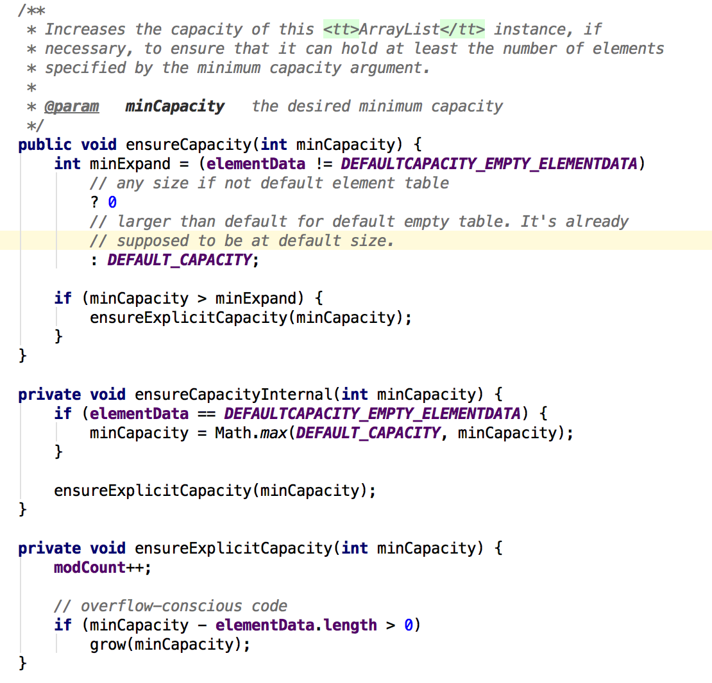

java8中的代码相比java7有小幅度改变，首先入口函数都会调用到ensureExplicitCapacity()这个方法，modCount一般是在迭代器中出现，这里是记录list结构被改变的次数。可以看出只有当minCapacity大于当前数组长度的时候才会调用grow方法，接下来看grow方法：

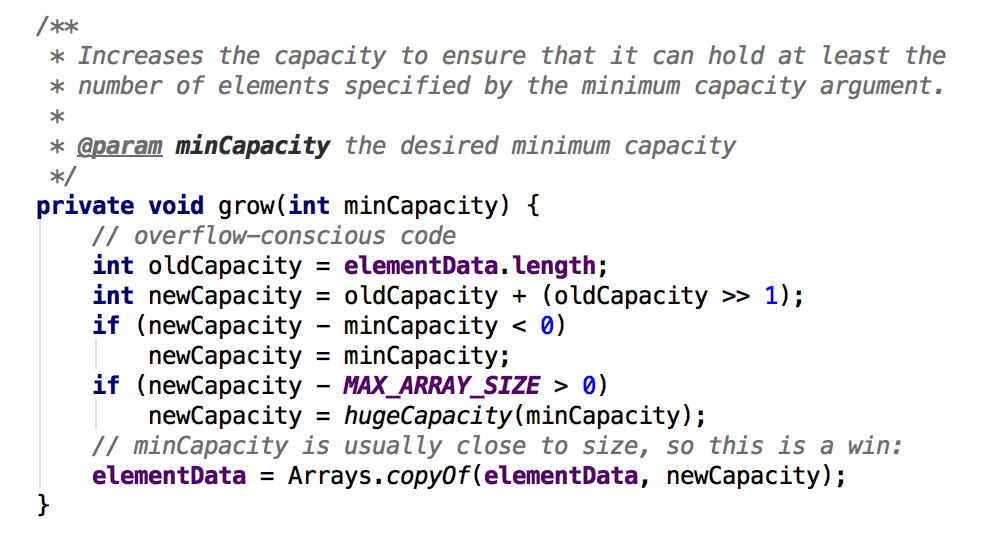

​    这里便于java7有点区别了，java7中的capacity计算如下：

java7中使用的数学公式，而java8中则使用位移操作，向又移一位后与java7中数组大小一致，位移操作要比数学公式快不少。然后确定newCapacity后，调用Arrays.copy方法生成了新的Array数组。

## **2.add操作**

add操作就是向ArrayList对象中插入一条新的数据，方法如下：

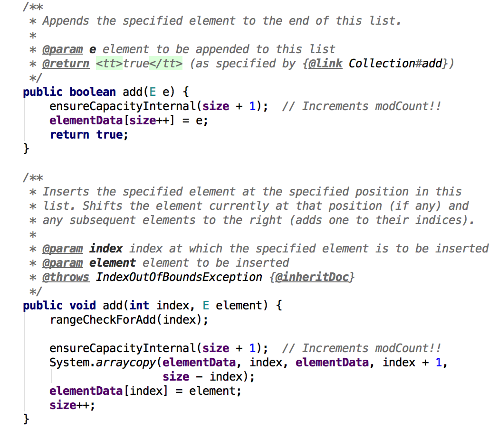

add有两个重载方法，第一个是默认向尾端插入数据，第二个可指定插入位置。两个方法都会首先调用ensureCapacityInternal，并且传入参数为size+1，这样就保证了ArrayList的数组永远不会超过界限。对于第二个方法，主要是调用了arrayCopy，其源码如下：

可看出这个是一个本地方法，看解释就很清楚了，arrayList就是把index上的数据往后移了一位。

# **linked****List内部实现**：

将从两方面来剖析linkedList，即存储结构-字段和功能实现-方法。

## **存储结构-字段**

从结构实现来讲，linkedList是双向链表实现的。首先从源码中看出

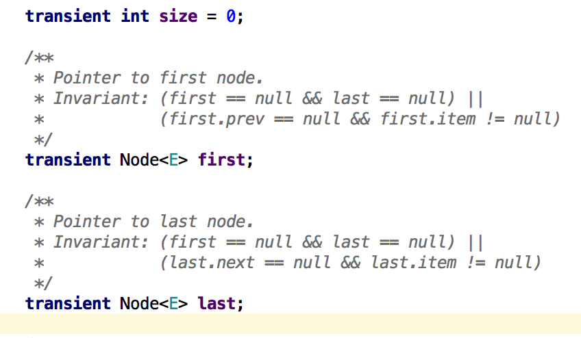link

相比java7来说还是有一点变化的，其中size用来表示当前对象中的个数，first，last分别指向头结点和尾结点。注意，都被申明为了transient类型，这个在下文中讲解。Node内部类源码如下：

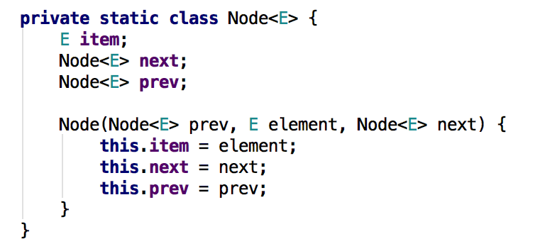

一看就清楚了，item是当前值，next和prev分别指向下一个节点和前一个节点。

## **功能实现-方法**

   linkedList中功能主要包括增删改查。由于是链表的数据结构，所以没有扩容方法，这里主要对add方法remove方法进讲解。

## **1.add操作：**

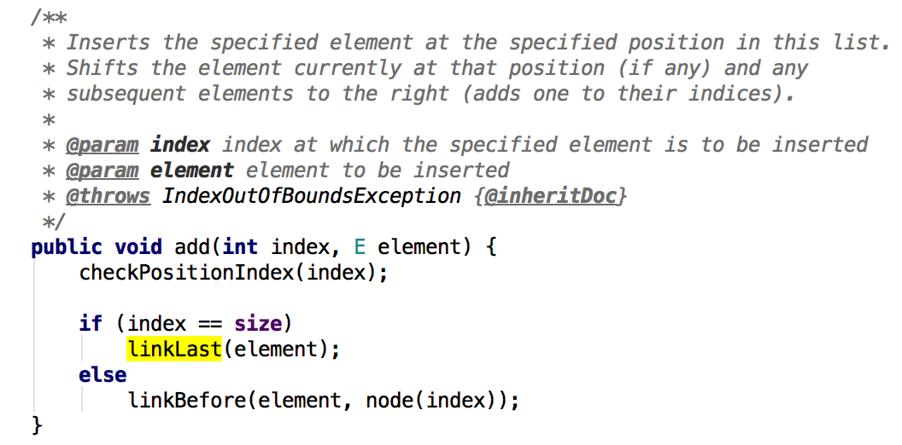

​     可以看出其中有checkPositionIndex、linkLast、linkBefore这三个方法，其中checkPositionIndex方法只有在指定插入index位时才有，用于校验index是否合法（合法的判断标准为必须大于0小于或等于size）。如果index==size那么直接根据last指针插入到最后即可，下面具体看一下node方法和linkBefore方法：

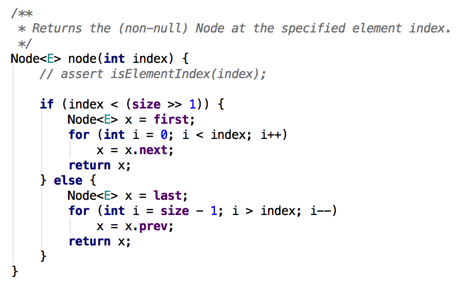

node方法就是根据index位置返回index位置上的结点。这里为了降低便利次数，如果index大于size的一般的话，那么就倒序开始遍历。

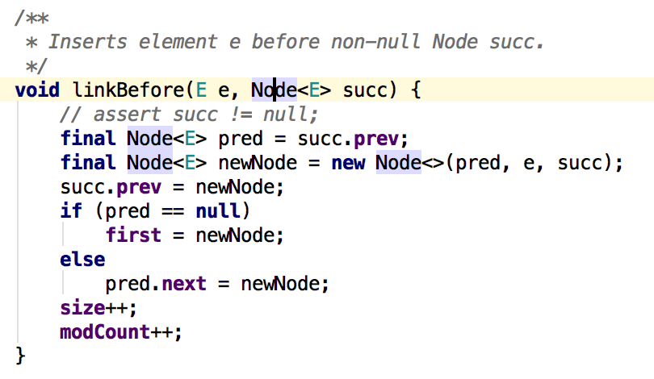

确定index位的node结点指针后，仅仅需要改变一下链表指向即可。注意这里的modCount也是用于迭代器中的。

## 

## **2.remove操作：**

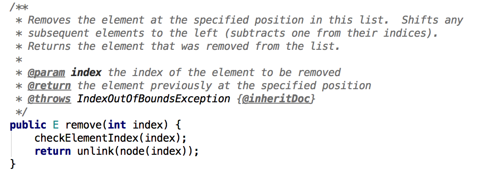

​     可以看出remove其实只做了两件事，1、检查index是否合法；2、调用unlink方法，传入index位置的node节点；下面我们看看unlink方法：

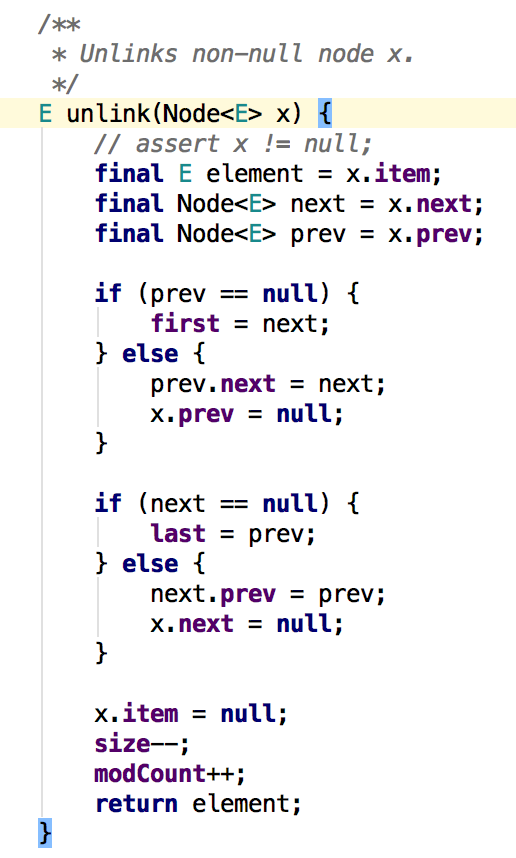

其实就是标准的聊表节点删除操作，要注意的是需要判断边界情况，即头结点和尾结点的情况。 

# **transient分析**

注意到的是ArrayList和LinkedList中的一些变量被transient关键字修饰。如ArrayList中的elementData数组，LinkedList中指向头结点和尾结点的指针等。下面解释一下transient关键字的作用：

​     java的serialization提供了一种持久化对象实例的机制。当持久化对象时，可能有一个特殊的对象数据成员，我不想用serialization机制来保存它。为了在一个特定对象的域上关闭serialization，可以在这个域前加上关键字transient。transient是一个关键字，用来表示一个于不是该对象串行化的一部分。当一个对象被串行化的时候，被transient关键字修饰的变量的值不包括在串行化的表示中，非transient型的变量是被包括进去的。

**那么既然用于保存数据的变量都被transient修饰，ArrayList和LinkedList还能不能被序列号呢？**

​     

答案是可以的。对于ArrayList来说，如果不把elementData申明为transient类型，那么序列化的时候里面的数据都会被序列化，但是elementData这个数组很大程序是存在空值的情况（即size<length），这时如果序列化就会导致磁盘空间被浪费。为了解决这个问题，ArrayList将elementData申明为transient，自己重写了writeObject方法，保证只序列化elementData中有数据的那部分，ArrayList中的writeObject方法如下：

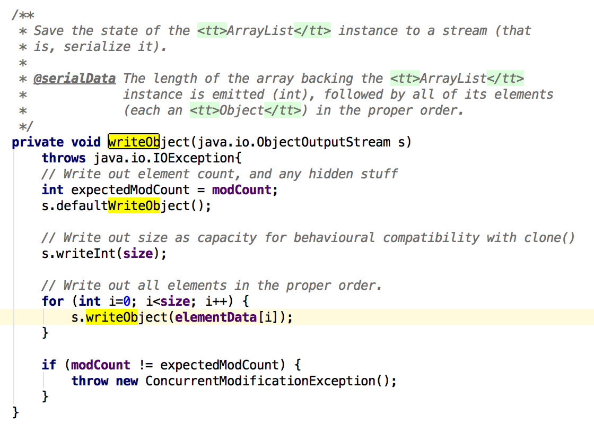

注意的是这里面也用到了modCount，如果不一致说明这段时间集合发生了改变，抛出异常。

LinkedList中的序列化和ArrayList中的序列化还不一样，LinkedList中不会存在说有多余的元素这种说法，但是由于LinkedList中申明为transient类型的数据都可以不用进行序列化，所以进行申明，比如分别指向头结点和尾结点的first和last指针。

# **迭代器分析：**

ArrayList和LikedList都提供了iterator()方法来获得当前对象的迭代器。实现迭代器必须要定义一个内部类来实现Iterator接口，下面便看看ArrayList的迭代器实现。

​     首先该类中有三个变量，分别为cursor，lastRet，expectedModCount。cursor为下个返回元素的索引，lastRet为最后一个返回元素的索引，初始值为-1，代表没有作用。expectedModCount为期望的改变次数，初始值为modCount，一旦两个值不一至，就会抛出ConcurrentModificationException异常；

​     首先所有的方法都先会调用checkForComodification这个方法，这个方法主要是判断modCount和expectedModCount是否一致，不一致就抛出异常。这就使得在迭代过程中modCount的值不能更改，即不能在迭代期间往list中新增数据和删除（调用迭代器的删除是可以的，下文分析）。

## **迭代器中方法分析：**

  

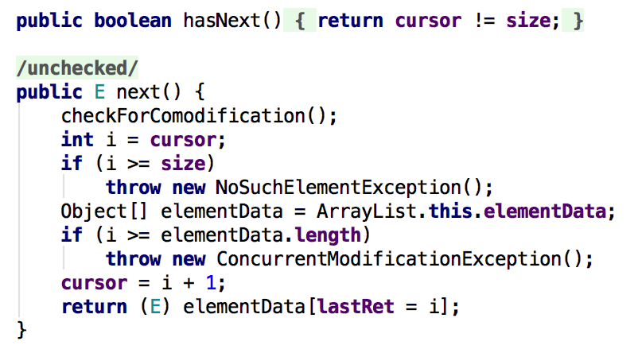

这两个方法非常清楚，首先hasNext方法一看就清楚，即判断元素是否迭代完。next返回的是cursor所指向的元素。接下来看看remove方法：

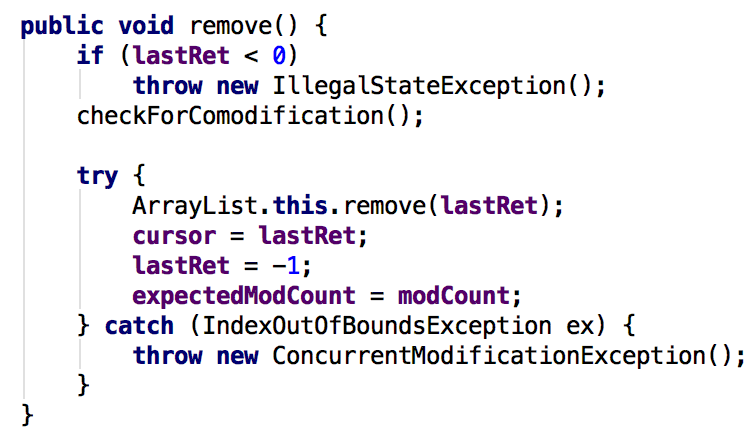

其实可以看出迭代器中的remove也是调用的是ArrayList中的remove方法，remove的索引就是lastRet，这里调用后lastRet被置为-1，所以remove方法在迭代器中只能调用一次。现在分析一下，为什么调用迭代器的remove方法就不会抛出ConcurrentModificationException异常。首先上文分析了为什么会抛出ConcurrentModificationException异常的原因，其实就是modCount和expectedModCount不相等，还有就是在方法调用过程中，发现cursor大于element.length时抛出。在remove方法中又重新将modCount的值赋给了expectedModCount，使得值再次相等，所以不会抛出异常。

# **优缺点对比：**

1、ArrayList是基于数组实现的，所以搜索和读取数据很快；获取数据的时间复杂度是O(1)，但是要删除和增加节点开销就很大，时间复杂度为O(N)。LinkedList是基于双链表实现的，所以插入和删除很快，时间复杂度为O(1)；但是随机索引速度就比较慢，时间复杂度为O(N)。

2、LinkedList对内存需求更高，因为需要存储的是实际的数据和前后节点的位置；ArrayList的每个索引的位置是实际的数据，所以对内存需求相比要小。

**参考文献：**

[java源码分析之LinkedList](https://km.sankuai.com/page/40977507)

[java笔记三：List接口](https://km.sankuai.com/page/40977507)

[LinkedList和ArrayList的区别](http://www.importnew.com/6629.html)

[java源码分析之ArrayList](https://km.sankuai.com/page/40977507)

