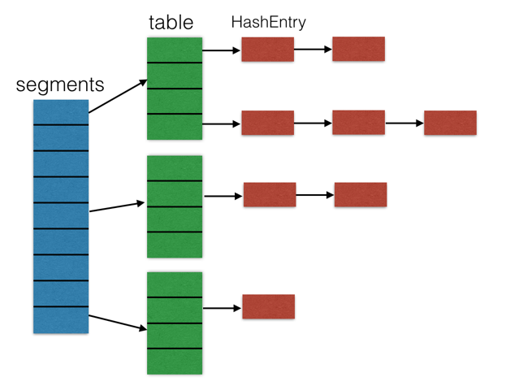
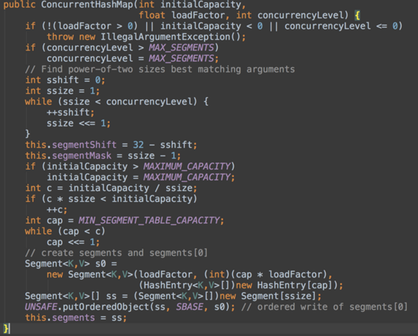
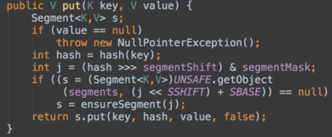
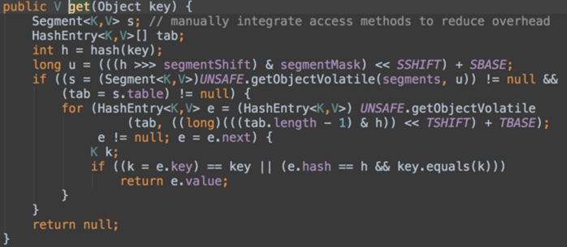
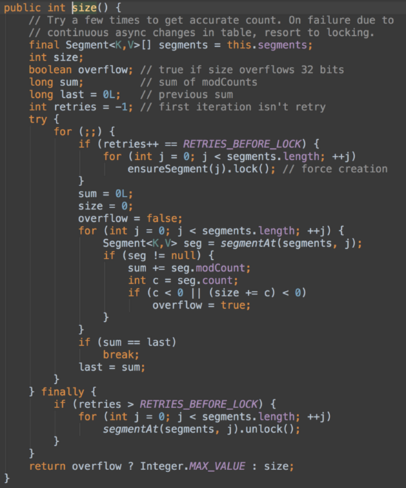

我们知道，HashMap不是线程安全的类，并且在多线程环境下有可能会产生死循环。而HashTable虽然是线程安全的，但是是通过在方法上加上synchronized关键字来实现的。这样做的弊端是，在任何一个操作时，都会进行加锁操作，大大降低了HashTable的性能。ConcurrentHashMap采用一种巧妙的设计，支持完全的读操作并发和高性能的更新操作并发。

数据结构如下

ConcurrentHashMap有segments字段，它是一个Segment类型的数组。Segment是ReentrantLock的子类，它有table字段（HashEntry类型的数组），每个Segment拥有一把锁。由上图可知，Segment的结构与HashMap类似，都是数组和链表的结合。

ConcurrentHashMap更新操作的突出的并发性能，正是得益于这样的数据结构。它采用了一种分段锁的机制，更新操作时不会造成整个Map的锁定。这种粒度更细的锁，是针对Segment的。也就是说，在对某个Segment进行更新操作时，不影响其他的Segment。假设segments的大小是n，那么最多可以有n个线程同时对ConcurrentHashMap进行操作而彼此之间不受影响。

 

初始化

先来看ConcurrentHashMap的构造方法，它有三个参数：initialCapacity，loadFactor，concurrencyLevel。

（1）initialCapacity是ConcurrentHashMap的初始容量，默认值是`16;`

（2）loadFactor是负载因子，当ConcurrentHashMap中的元素个数大于loadFactor*最大容量时就需要进行扩容，默认值是`0.75;`

（3）concurrencyLevel表示并发级别，默认值是`16`。Segment的个数是由并发级别决定的，其值是大于等于concurrencyLevel的第一个2的n幂的那个数。最理想的情况下，并发访问ConcurrentHashMap的更新操作的线程数能够达到concurrencyLevel。这是因为Segment大于等于concurrencyLevel，假如有concurrencyLevel个线程需要访问Map，并且需要访问的数据都恰好分别落在不同的Segment中，则这些线程能够无竞争地自由访问（因为他们不需要竞争同一把锁），达到同时访问的效果。

初始化的一些动作：

1. 验证参数的合法性，如果不合法，直接抛出异常。
2. concurrencyLevel也就是Segment的个数不能超过规定的最大Segment的个数，默认值为`static final int MAX_SEGMENTS = 1 << 16;`，如果超过这个值，设置为这个值。
3. 然后使用循环找到大于等于concurrencyLevel的第一个2的n次方的数ssize，这个数就是Segment数组的大小，并记录一共向左按位移动的次数sshift，并令`segmentShift = 32 - sshift`，并且segmentMask的值等于ssize - 1，segmentMask的各个二进制位都为1，目的是之后可以通过key的hash值与这个值做**&运算**确定Segment的索引。
4. 检查给的容量值是否大于允许的最大容量值，如果大于该值，设置为该值。最大容量值为`static final int MAXIMUM_CAPACITY = 1 << 30;`。
5. 然后计算每个Segment平均应该放置多少个元素，这个值c是向上取整的值。比如初始容量为15，Segment个数为4，则每个Segment平均需要放置4个元素。
6. 最后创建一个Segment实例，将其当做Segment数组的第一个元素。

## put操作

put操作的源码如下：

由代码可见，先要通过key的哈希值的高位来确定存放键值对的segment，然后再将键值对插入到对应的segment的table中。

## get操作

get操作的源码如下：

get操作与put操作类似，都是先确定segment，再到segment的table中查找键值对。

 

## size操作

size操作与put和get操作最大的区别在于，它需要遍历所有的Segment才能算出整个Map的大小，而put和get都只涉及到一个Segment。假设我们当前遍历到的Segment是Sj，而此时之前已经遍历过的Segment Si发生了变化（进行了添加或删除操作）。那么这一次计算出来的size值可能就会不准确。一个比较简单的办法就是计算Map大小的时候所有的Segment都Lock住，不能更新(包含put，remove等等)数据，计算完之后再Unlock。而ConcurrentHashMap采用了一种更好的方法：先对Map最多进行三次遍历，在遍历的过程中，除了要记录每个segment的大小，还要记录所有Segment的modCount之和（记为sum）。如果相邻的两次遍历得到的sum值相同，那么说明在遍历过程中，Map没有发生变化，那么说明得到的size是准确的。如果三次遍历都没有得到准确的size，那就对所有Segment加锁，再计算size，最后释放锁。

