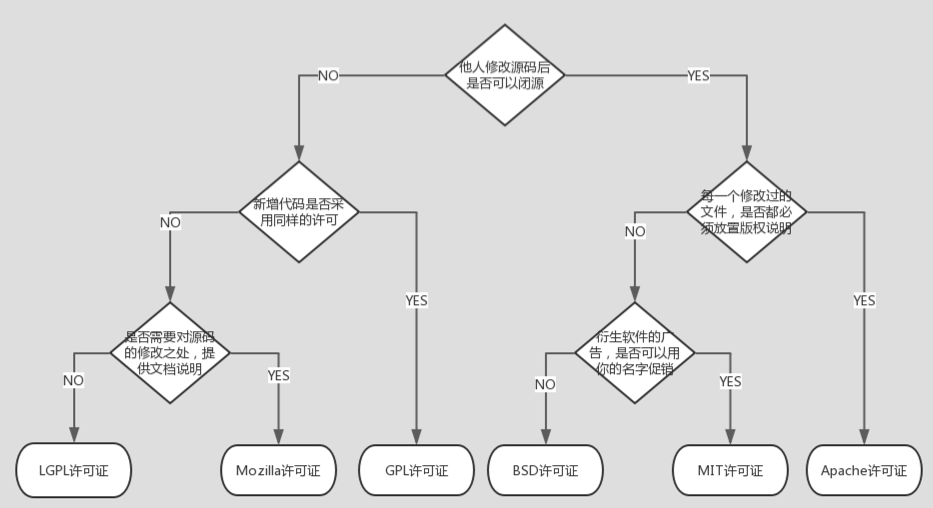

# 背景

开源软件是自由的，免费的，源代码开发的，我们可以自由的下载安装和使用。但是开源不等于免费，开源也不等于没有约束。好多开源协议最低要求是使用者需要保留原作者对代码的声明，如果我们Copy了别人的代码或者文字同时没有注意这些的话，我们的作品可能会因触犯别人的权益而违法。所以了解开源协议是很有必要的，本文就来比较一下常见的开源协议。

# 常见的开源协议

这里列出最常见的几种开源协议：

- - GPL （GNU General Public License） ：GNU通用公共许可协议
  - AGPL  （GNU Affero General Public License） ：GUN窄通用公共许可协议
  - LGPL （GNU Lesser General Public License） ：GNU宽通用公共许可协议
  - BSD (Berkeley Software Distribution)  :伯克利软件分发许可协议
  - MIT （Massachusetts Institute of Technology）：MIT许可协议之名源自麻省理工学院，又称“X许可协议”或“X11许可协议”
  - Apache （Apache License） ：Apache许可协议
  - MPL （Mozilla Public License） ：Mozilla公共许可协议

## GPL

GPL协议是最为广泛使用的开源协议，拥有较强的版权自由（copyleft）要求。GPL保证了所有开发者的权利，同时为使用者提供了足够的复制，分发，修改的权利，衍生代码的分发需要开源并且也要遵守此协议。

- **可自由复制**
  你可以将软件复制到任何地方，并且复制份数没有限制
- **可自由分发**
  可在你的网站提供给他人下载，拷贝给他人等
- **可以用来盈利**
  可以在分发软件的时候收费，但是必须在收费前向你的客户提供该软件的GPL许可协议，以便让他们知道，可以从别的渠道免费获取到该软件，以及你收费的理由
- **可自由修改**
  可以添加或删除某个功能，也可在别的项目中使用部分代码。唯一的要求是，使用了这段代码的项目也必须使用GPL协议。

这意味着，只要有一个软件中使用（“使用”指类库引用或者修改后的代码）GPL协议的产品，则该软件产品也必须采用GPL协议，即也必须是开源和免费的；也就是说GPL是具有“传染性的”。商业软件不能使用GPL

采用这个协议的开源软件有：Linux、MySQL

## AGPL

AGPL是GPL更严格的版本。只要你用了任何该协议的库、甚至是一段代码，那么运行时和它相关的所有软件、包括通过网络联系的所有软件，必须全部遵循协议开源。

AGPL的出现是由于GPL协议在现在网络服务公司（不分发软件，为客户提供网络服务，入Google）兴起时产生了一定的漏洞，比如使用GPL的自由软件，但是并不发布在网络之中，则可以自由的使用GPL协议却不开源自己私有的解决方案。因此GPL的约束生效的前提是“发布”软件，AGPL协议在GPL协议的基础上加上了这个约束。

## LGPL

由于GPL太严格，限制了很多商业软件使用GPL组件才推出了LGPL。LGPL允许商业软件通过引用类库的方式使用LGPL组件（不直接使用源代码），这样采用LGPL协议的开源代码可以被商业软件作为类库引用并发布和销售。

但是如果修改LGPL协议的代码或者其衍生，则所有修改的代码，涉及修改部分的额外代码和衍生的代码都必须采用LGPL协议。因此LGPL协议的开源代码很适合作为第三方类库被商业软件引用，但不适合希望以LGPL协议代码为基础，通过修改和衍生的方式做二次开发的商业软件采用。

采用这个协议的开源软件有：JBoss、Hibernate

GPL/LGPL都保障了原作者的知识产权，避免有人利用开源代码复制并开发类似的产品。

## BSD

BSD开源协议是一个给予使用者很大自由的协议。基本上使用者可以用“为所欲为”，可以自由的使用，修改源代码，也可以将修改后的代码作为开源或者商业软件再发布，因此是适用于商业软件的。

但“为所欲为”的前提是当你发布了使用BSD协议的代码，或者以BSD协议代码为基础做二次开发自己的产品时，需要满足三个条件：

1. 1. 如果再发布的产品中包含源代码，则在源代码中必须带有原来代码中的BSD协议
   2. 如果再发布的只是二进制类库/软件，则需要在类库/软件的文档和声明中包含原来的代码的中的BSD协议
   3. 不可以用开源代码的作者/机构名字和原来产品的名字做市场推广

BSD鼓励代码共享，但需要尊重代码作者的著作权。BSD由于允许使用者修改和重新发布代码，也允许使用或在BSD代码上开发商业软件来发布和销售，因此对商业集成很友好。

采用这个协议的开源软件有：Nginx、Redis

## MIT

MIT协议是几大开源协议中最宽松的一个，除了必须包含许可声明外，再无任何限制。核心条款是：

该软件及其相关文档对所有人免费，可以任意处置，包括使用，复制，修改，合并，发表，分开，再授权，或者销售。唯一的限制是，软件中必须包含上述版权和许可提示。这意味着：

1. 1. 你可以自由使用，复制，修改，可以用于自己的项目
   2. 可以免费分发或用来盈利
   3. 唯一的限制是必须包含许可声明

采用这个协议的开源软件有：jQuery、Node.js

## Apache

Apache为用户提供版权许可之外，还有专利许可。与BSD协议权限类似， 允许代码修改，再发布，适用商业软件。但是也需要满足以下条件：

- 需要给代码的用户一份Apache Licence。
- 如果你修改了代码，需要再被修改的文件中说明。
- 在延伸的代码中（修改和有源代码衍生的代码中）需要带有原来代码中的协议，商标，专利声明和其他原来作者规定需要包含的说明。
- 如果再发布的产品中包含一个Notice文件，则在Notice文件中需要带有Apache Licence。你可以在Notice中增加自己的许可，但不可以表现为对Apache Licence构成更改。

除了这些条件它还有这些好处：

- **永久权利** 一旦被授权，永久拥有。
- **全球范围的权利** 在一个国家获得授权，适用于所有国家。假如你在美国，许可是从印度授权的，也没有问题。
- **授权免费** 无版税， 前期、后期均无任何费用。
- **授权无排他性** 任何人都可以获得授权
- **授权不可撤消** 一旦获得授权，没有任何人可以取消。比如，你基于该产品代码开发了衍生产品，你不用担心会在某一天被禁止使用该代码

采用这个协议的开源软件有：Hadoop、Apache HttpServer、Spring、MongoDB、kafka、storm、zookeeper、mesos、dubbo、Thrift、fastjson

## MPL

MPL允许在其授权下的源代码与其他授权的文件进行混合，包括私有许可证。但在MPL授权下的代码文件必须保持MPL授权，并且保持开源。这样的条款让MPL既不像MIT和BSD那样允许派生作品完全转化为私有，也不像GPL那样要求所有的派生作品，包括新的组件在内，全部必须保持GPL。通过允许在派生项目中存在私有模块，同时保证核心文件的开源，MPL同时激励了商业及开源社区来参与帮助开发核心软件。

 这种授权维护了商业软件的利益，它要求基于这种软件的修改无偿贡献版权给该软件。这样，围绕该软件得所有代码得版权都集中在发起开发人得手中。但MPL是允许修改，无偿使用得。

# 一图抵千言

 

# 各协议授权详情

先来了解一些下方表格中出现的用词的解释：

- - 协议和版权信息(License and copyright notice)：在代码中保留作者提供的协议和版权信息
  - 声明变更(State Changes)：在代码中声明对原来代码的重大修改及变更
  - 公开源码(Disclose Source)：代码必需公开。如果是基于LGPL协议 下，则只需使用的开源代码公开，不必将整个软件源码公开
  - 库引用(Library usage)：该库可以用于商业软件中
  - 责任承担(Hold Liable)：代码的作者承担代码使用后的风险及产生的后果
  - 商标使用(Use Trademark)：可以使用作者的姓名，作品的Logo，或商标
  - 附加协议(Sublicensing)：允许在软件分发传播过程中附加上原来没有的协议条款等

| 协议   | 描述                                                         | 要求                           | 允许                             | 禁止             |
| :----- | :----------------------------------------------------------- | :----------------------------- | :------------------------------- | :--------------- |
| 协议   | 描述                                                         | 要求                           | 允许                             | 禁止             |
| GPL    | 此协议是应用最为广泛的开源协议，拥有较强的版权自由( copyleft )要求。衍生代码的分发需开源并且也要遵守此协议。此协议有许多变种，不同变种的要求略有不同。 | 公开源码协议和版权信息声明变更 | 商用分发修改专利授权私用         | 责任承担附加协议 |
| LGPL   | 主要用于一些代码库。衍生代码可以以此协议发布（言下之意你可以用其他协议），但与此协议相关的代码必需遵循此协议 | 公开源码库引用协议和版权信息   | 商用分发修改专利授权私用附加协议 | 责任承担         |
| BSD    | 较为宽松的协议，包含两个变种，都只与MIT存在细微差异。        | 协议和版权信息                 | 商用分发修改私用附加协议         | 责任承担         |
| MIT    | 宽松简单且精要的一个协议。在适当标明来源及免责的情况下，它允许你对代码进行任何形式的使用。 | 协议和版权信息                 | 商用分发修改私用附加协议         | 责任承担         |
| Apache | 一个较宽松且简明地指出了专利授权的协议。                     | 协议和版权信息声明变更         | 商用分发修改专利授权私用附加协议 | 责任承担商标使用 |
| MPL    | 此协议旨在较为宽松的BSD协议和更加互惠的GPL协议中寻找一个折衷点。 | 公开源码协议和版权信息         | 商用分发修改专利授权私用附加协议 | 责任承担商标使用 |

# 引用

[http://blog.csdn.net/u014680729/article/details/24382261](http://blog.csdn.net/u014680729/article/details/24382261)

[http://www.cnblogs.com/Wayou/p/how_to_choose_a_license.html](http://www.cnblogs.com/Wayou/p/how_to_choose_a_license.html)

[http://blog.csdn.net/techbirds_bao/article/details/8785413](http://blog.csdn.net/techbirds_bao/article/details/8785413)

[http://blog.jobbole.com/44175/](http://blog.jobbole.com/44175/)

https://my.oschina.net/zsjasper/blog/350092

[http://blog.csdn.net/nightmare/article/details/12405109](http://blog.csdn.net/nightmare/article/details/12405109)