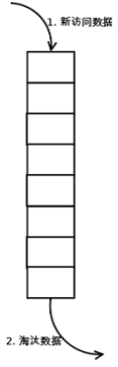

1. FIFO：First In First Out，先进先出。判断被存储的时间，离目前最远的数据优先被淘汰。
2. LRU：Least Recently Used，最近最少使用。判断最近被使用的时间，目前最远的数据优先被淘汰。
3. LFU：Least Frequently Used，最不经常使用。在一段时间内，数据被使用次数最少的，优先被淘汰。

# **FIFO**

**原理：**

按照“先进先出（First In, First Out）” 的原理淘汰数据

1.新访问的数据插入FIFO队列尾部，数据在FIFO队列中顺序移动

2.淘汰FIFO队列头部的数据

**实现：**

在FIFO Cache中应该支持以下操作;

get(key)：如果Cache中存在该key，则返回对应的value值，否则，返回-1；

set(key,value)：如果Cache中存在该key，则重置value值；如果不存在该key，则将该key插入到到Cache中，若Cache已满，则淘汰最早进入Cache的数据。

举个例子：假如Cache大小为3，访问数据序列为set(1,1),set(2,2),set(3,3),set(4,4),get(2),set(5,5)

则Cache中的数据变化为：

　　(1,1)                               set(1,1)

　　(1,1) (2,2)                       set(2,2)

　　(1,1) (2,2) (3,3)               set(3,3)

　　(2,2) (3,3) (4,4)               set(4,4)

　　(2,2) (3,3) (4,4)               get(2)

　　(3,3) (4,4) (5,5)               set(5,5)

实现FIFO的数据结构很多，下面列出一种思路：

1.利用一个双向链表保存数据，当来了新的数据之后便添加到链表末尾，如果Cache存满数据，则把链表头部数据删除，然后把新的数据添加到链表末尾。在访问数据的时候，如果在Cache中存在该数据的话，则返回对应的value值；否则返回-1。如果想提高访问效率，可以利用hashmap来保存每个key在链表中对应的位置。

**分析**

**命中率**：命中率太低，所以实际应用中基本不会采用

**复杂度**：简单

**代价**：实现代价很小

实现代码就不给出了。

# **LRU**

LRU 已经写过了，参照wiki： [LRU](LRU.md)

# **LFU**

**原理：**

LFU（Least Frequently Used）算法根据数据的历史访问频率来淘汰数据，其核心思想是“如果数据过去被访问多次，那么将来被访问的频率也更高”。LFU的每个数据块都有一个引用计数，所有数据块按照引用计数排序，具有相同引用计数的数据块则按照时间排序。

\1. 新加入数据插入到队列尾部（因为引用计数为1）；

\2. 队列中的数据被访问后，引用计数增加，队列重新排序；

\3. 当需要淘汰数据时，将已经排序的列表最后的数据块删除。

**实现：**

注意LFU和LRU算法的不同之处，LRU的淘汰规则是基于访问时间，而LFU是基于访问次数的。举个简单的例子：

​     假设缓存大小为3，数据访问序列为set(2,2),set(1,1),get(2),get(1),get(2),set(3,3),set(4,4)，

​     则在set(4,4)时对于LFU算法应该淘汰(3,3)，而LRU应该淘汰(1,1)。

那么LFU Cache应该支持的操作为：

　　get(key)：如果Cache中存在该key，则返回对应的value值，否则，返回-1；

　　set(key,value)：如果Cache中存在该key，则重置value值；如果不存在该key，则将该key插入到到Cache中，若Cache已满，则淘汰最少访问的数据。

下面给出实现LFU的一种思路：

1.利用一个数组存储 数据项，用hashmap存储每个数据项在数组中对应的位置，然后为每个数据项设计一个访问频次，当数据项被命中时，访问频次自增，在淘汰的时候淘汰访问频次最少的数据。这样一来的话，在插入数据和访问数据的时候都能达到O(1)的时间复杂度，在淘汰数据的时候，通过选择算法得到应该淘汰的数据项在数组中的索引，并将该索引位置的内容替换为新来的数据内容即可，这样的话，淘汰数据的操作时间复杂度为O(n)。

**分析**

**命中率**：一般情况下，LFU效率要优于LRU，且能够避免周期性或者偶发性的操作导致缓存命中率下降的问题。但LFU需要记录数据的历史访问记录，一旦数据访问模式改变，LFU需要更长时间来适用新的访问模式，即：LFU存在历史数据影响将来数据的“缓存污染”效用。

**复杂度**：需要维护一个队列记录所有数据的访问记录，每个数据都需要维护引用计数。

**代价**：需要记录所有数据的访问记录，内存消耗较高；需要基于引用计数排序，性能消耗较高。

**扩展：**

# **LFU-Aging**

**原理**

基于LFU的改进算法，其核心思想是“除了访问次数外，还要考虑访问时间”。这样做的主要原因是解决LFU缓存污染的问题。

**实现**

虽然LFU-Aging考虑时间因素，但其算法并不直接记录数据的访问时间，而是通过平均引用计数来标识时间。

LFU-Aging在LFU的基础上，增加了一个最大平均引用计数。当当前缓存中的数据“引用计数平均值”达到或者超过“最大平均引用计数”时，则将所有数据的引用计数都减少。减少的方法有多种，可以直接减为原来的一半，也可以减去固定的值等。

**分析**

**命中率**：LFU-Aging的效率和LFU类似，当访问模式改变时，LFU-Aging能够更快的适用新的数据访问模式，效率要高。

**复杂度**：在LFU的基础上增加平均引用次数判断和处理。

**代价**：和LFU类似，当平均引用次数超过指定阈值（Aging）后，需要遍历访问列表。

**性能对比：**

LFU > LRU > FIFO 

原文：

https://km.sankuai.com/page/40977536